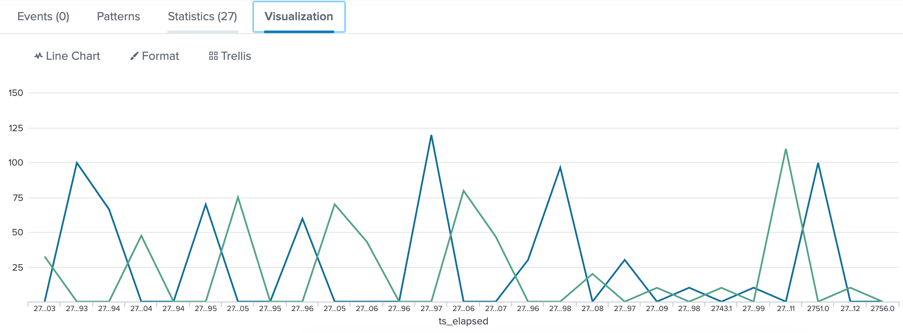
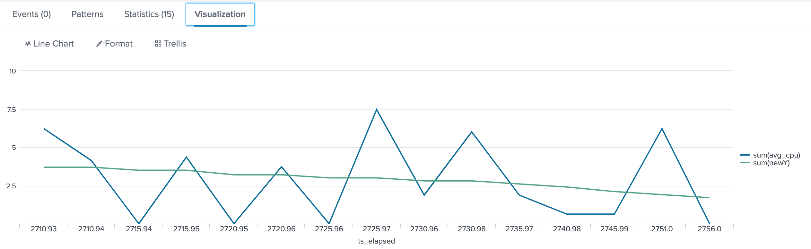
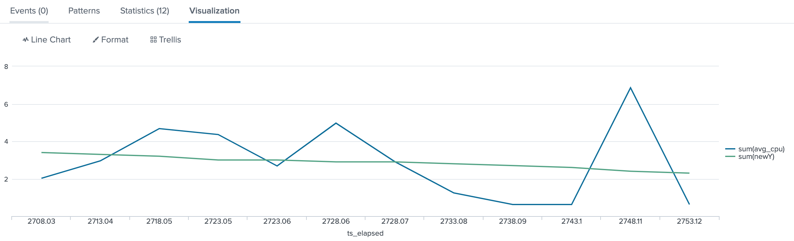

## Problems now we have
### 1. Average value of resources usage can not accurately reflect the reality 
**example1**:
The graph is almost the same but average value with big difference.



SPL:
```
index=perfharness sourcetype=perfharness*high_concurrency_test job_name=monitor_splunk fields.subtest=search test_id="test-8f384066-013b-11ea-8c34-0a1902872cca" OR test_id="test-ca04691e-fee2-11e9-a2df-02bfbff270e6" | rename data.* as * fields.search_name as search_name | search search_name=dense_stats_high_cardinality_4 |  rename proc_resource{}.cpu_pct AS cpu_used | rename proc_resource{}.search_props.sid as sid | eval resource_usage=mvzip(sid,cpu_used)  | eval resource_usage=mvzip(resource_usage, test_elapsed) | eval resource_usage=mvzip(resource_usage, search_name) | eval resource_usage=mvzip(resource_usage, test_id) | table resource_usage| mvexpand resource_usage | eval resource_usage=split(resource_usage,",") | eval sid=mvindex(resource_usage,0) | eval cpu=mvindex(resource_usage,1) | eval ts_elapsed=mvindex(resource_usage,2) | eval search_name=mvindex(resource_usage,3) |eval test_id=mvindex(resource_usage,4) | eval type=search_name+"_"+ test_id | chart avg(cpu) over ts_elapsed by test_id 
```

The average values of these two is :

|test_id|avg(cpu)|
|  ----  | ----  |
|test-8f384066-013b-11ea-8c34-0a1902872cca |60.487999999999985 |
|test-ca04691e-fee2-11e9-a2df-02bfbff270e6|47.784|
	

SPL: 
``` 
index=perfharness sourcetype=perfharness*high_concurrency_test job_name=monitor_splunk fields.subtest=search test_id="test-8f384066-013b-11ea-8c34-0a1902872cca" OR test_id="test-ca04691e-fee2-11e9-a2df-02bfbff270e6" | rename data.* as * fields.search_name as search_name | search search_name=dense_stats_high_cardinality_4 |  rename proc_resource{}.cpu_pct AS cpu_used | rename proc_resource{}.search_props.sid as sid | eval resource_usage=mvzip(sid,cpu_used)  | eval resource_usage=mvzip(resource_usage, test_elapsed) | eval resource_usage=mvzip(resource_usage, search_name) | eval resource_usage=mvzip(resource_usage, test_id) | table resource_usage| mvexpand resource_usage | eval resource_usage=split(resource_usage,",") | eval sid=mvindex(resource_usage,0) | eval cpu=mvindex(resource_usage,1) | eval ts_elapsed=mvindex(resource_usage,2) | eval search_name=mvindex(resource_usage,3) |eval test_id=mvindex(resource_usage,4) | eval type=search_name+"_"+ test_id |stats avg(cpu) by test_id
```

The deviation between 47 and 60 is about 20%. **We can not take this as the resource usage metrics**. Because we consider the graph above shows that the resource usage is not big difference.In fact we run this two test using same build, same test code and same env. 

### 2. How to eliminate redundant information to help getting a value that can reflect the reality of resources usage
So how this big deviation occurs in **example1**?

I think is because there are so many redundant information.

The resources usages we monitored is some kind of random.We have to find regularity of random data. 

I think [trendline](https://en.wikipedia.org/wiki/Trend_line) (or [Linear regression](https://en.wikipedia.org/wiki/Linear_regression) or Fitting)is good mathmatical mean.

From wikipedia:

> Linear regression has many practical uses. Most applications fall into one of the following two broad categories:
> If the goal is prediction, or forecasting, or error reduction, linear regression can be used to fit a predictive model to an observed data set of values of the response and explanatory variables. After developing such a model, if additional values of the explanatory variables are collected without an accompanying response value, the fitted model can be used to make a prediction of the response.
> If the goal is to explain variation in the response variable that can be attributed to variation in the explanatory variables, linear regression analysis can be applied to quantify the strength of the relationship between the response and the explanatory variables, and in particular to determine whether some explanatory variables may have no linear relationship with the response at all, or to identify which subsets of explanatory variables may contain redundant information about the response.

## The mathmatical mean to eliminate redundant data: Plotting a linear trendline
There is a implement in Splunk: [https://wiki.splunk.com/Community:Plotting_a_linear_trendline](https://wiki.splunk.com/Community:Plotting_a_linear_trendline)

We can create a macro( `lineartrend(2)` ) in splunk:

SPL:

```
eventstats count as numevents sum($x$) as sumX sum($y$) as sumY sum(eval($x$*$y$)) as sumXY sum(eval($x$*$x$)) as sumX2 sum(eval($y$*$y$)) as sumY2 | eval slope=((numevents*sumXY)-(sumX*sumY))/((numevents*sumX2)-(sumX*sumX)) | eval yintercept= (sumY-(slope*sumX))/numevents | eval newY=(yintercept + (slope*$x$)) | eval R=((numevents*sumXY) - (sumX*sumY))/sqrt(((numevents*sumX2)-(sumX*sumX))* ((numevents*sumY2)-(sumY*sumY))) | eval R2=R*R
```

The macro `lineartrend` gets passed two arguments, x and y values from each event, and creates the following fields for each event:

* slope - the slope of the trendline,
* yintercept - the y-intercept of the trendline
* R - coefficient of correlation
* R2- R-squared, the coefficent of determination
* newY - the trendline values

Trendline helped us eliminating the redundant data. Now we can take the **avg(newY)** as the value we want.

## The average value based on trendline value can reflect the reality
Back to our **example1**, let's get the value by our new way to check if this new value can reflect the resource usage reality.

We process two test respectively:

1. Firstly we draw trendline
2. Secondly we get the avg(newY) as the value we want
3. Check wether two values is closely

### test_id="test-8f384066-013b-11ea-8c34-0a1902872cca" 
1.draw trend line:




SPL:
```
index=perfharness sourcetype=perfharness*high_concurrency_test job_name=monitor_splunk fields.subtest=search test_id="test-8f384066-013b-11ea-8c34-0a1902872cca" | rename data.* as * fields.search_name as search_name | search search_name=dense_stats_high_cardinality_4 |  rename proc_resource{}.cpu_pct AS cpu_used | rename proc_resource{}.search_props.sid as sid | eval resource_usage=mvzip(sid,cpu_used)  | eval resource_usage=mvzip(resource_usage, test_elapsed) | eval resource_usage=mvzip(resource_usage, search_name) | eval resource_usage=mvzip(resource_usage, test_id) | table resource_usage| mvexpand resource_usage | eval resource_usage=split(resource_usage,",") | eval sid=mvindex(resource_usage,0) | eval cpu=mvindex(resource_usage,1) |  eval cpu=cpu/16| eval ts_elapsed=mvindex(resource_usage,2) | eval search_name=mvindex(resource_usage,3) |eval test_id=mvindex(resource_usage,4) | eval type=search_name+"_"+ test_id |chart avg(cpu) as avg_cpu over ts_elapsed | `lineartrend(ts_elapsed,avg_cpu)` | chart sum(avg_cpu) sum(newY) over ts_elapsed
```

2.get the avg(newY)

| avg(newY2) |  
| --- | 
| 2.8733333333333335 |  

SPL:
``` 
index=perfharness sourcetype=perfharness*high_concurrency_test job_name=monitor_splunk fields.subtest=search test_id="test-8f384066-013b-11ea-8c34-0a1902872cca" | rename data.* as * fields.search_name as search_name | search search_name=dense_stats_high_cardinality_4 |  rename proc_resource{}.cpu_pct AS cpu_used | rename proc_resource{}.search_props.sid as sid | eval resource_usage=mvzip(sid,cpu_used)  | eval resource_usage=mvzip(resource_usage, test_elapsed) | eval resource_usage=mvzip(resource_usage, search_name) | eval resource_usage=mvzip(resource_usage, test_id) | table resource_usage| mvexpand resource_usage | eval resource_usage=split(resource_usage,",") | eval sid=mvindex(resource_usage,0) | eval cpu=mvindex(resource_usage,1) |  eval cpu=cpu/16| eval ts_elapsed=mvindex(resource_usage,2) | eval search_name=mvindex(resource_usage,3) |eval test_id=mvindex(resource_usage,4) | eval type=search_name+"_"+ test_id |chart avg(cpu) as avg_cpu over ts_elapsed | `lineartrend(ts_elapsed,avg_cpu)` | chart sum(avg_cpu) sum(newY) as newY2  over ts_elapsed | stats avg(newY2)
```

### test_id="test-ca04691e-fee2-11e9-a2df-02bfbff270e6"
1.draw trend line:




SPL:
```
index=perfharness sourcetype=perfharness*high_concurrency_test job_name=monitor_splunk fields.subtest=search test_id="test-ca04691e-fee2-11e9-a2df-02bfbff270e6" | rename data.* as * fields.search_name as search_name | search search_name=dense_stats_high_cardinality_4 |  rename proc_resource{}.cpu_pct AS cpu_used | rename proc_resource{}.search_props.sid as sid | eval resource_usage=mvzip(sid,cpu_used)  | eval resource_usage=mvzip(resource_usage, test_elapsed) | eval resource_usage=mvzip(resource_usage, search_name) | eval resource_usage=mvzip(resource_usage, test_id) | table resource_usage| mvexpand resource_usage | eval resource_usage=split(resource_usage,",") | eval sid=mvindex(resource_usage,0) | eval cpu=mvindex(resource_usage,1)| eval cpu=cpu/16 | eval ts_elapsed=mvindex(resource_usage,2) | eval search_name=mvindex(resource_usage,3) |eval test_id=mvindex(resource_usage,4) | eval type=search_name+"_"+ test_id |chart avg(cpu) as avg_cpu over ts_elapsed | `lineartrend(ts_elapsed,avg_cpu)` | chart sum(avg_cpu) sum(newY) over ts_elapsed
```

2.get the avg(newY)

| avg(newY2) |  
| --- | 
| 2.8749999999999996 |  

SPL:
```
index=perfharness sourcetype=perfharness*high_concurrency_test job_name=monitor_splunk fields.subtest=search test_id="test-ca04691e-fee2-11e9-a2df-02bfbff270e6" | rename data.* as * fields.search_name as search_name | search search_name=dense_stats_high_cardinality_4 |  rename proc_resource{}.cpu_pct AS cpu_used | rename proc_resource{}.search_props.sid as sid | eval resource_usage=mvzip(sid,cpu_used)  | eval resource_usage=mvzip(resource_usage, test_elapsed) | eval resource_usage=mvzip(resource_usage, search_name) | eval resource_usage=mvzip(resource_usage, test_id) | table resource_usage| mvexpand resource_usage | eval resource_usage=split(resource_usage,",") | eval sid=mvindex(resource_usage,0) | eval cpu=mvindex(resource_usage,1)| eval cpu=cpu/16 | eval ts_elapsed=mvindex(resource_usage,2) | eval search_name=mvindex(resource_usage,3) |eval test_id=mvindex(resource_usage,4) | eval type=search_name+"_"+ test_id |chart avg(cpu) as avg_cpu over ts_elapsed | `lineartrend(ts_elapsed,avg_cpu)` | chart sum(avg_cpu) sum(newY) as newY2  over ts_elapsed | stats avg(newY2)
```

### Check
2.873 and 2.874 is very close.

So we can see this way is work and good to describe the resource usage reality.

And we still check this way in other situation,like resource usage graph is clearly different and the **avg(newY)** is far different. 

## Rules
Based on the preceding discussion I think the **avg(newY)** value is relatively accurately.

**Now we set a rule that deviation of avg(newY) <10% is one condition.**

Meantime, extreme peak value may be mitigated in this case. So we **need another condition that is the peek value ( max(resource_usage) ) is close(<10%)**.

**Only this two conditions are both pass then the KPI pass.**


